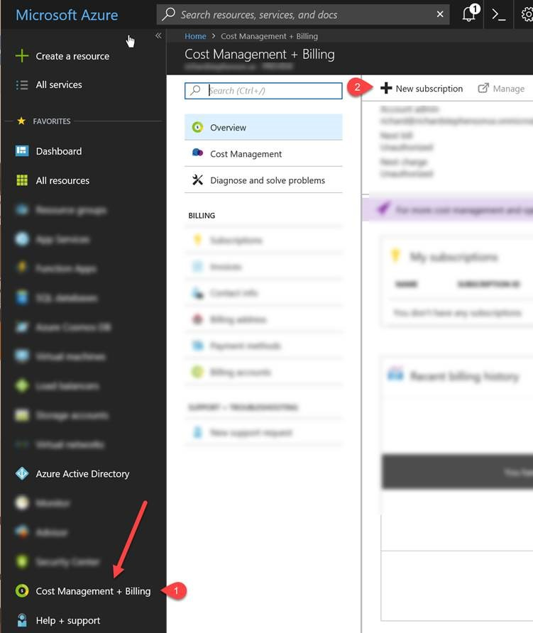
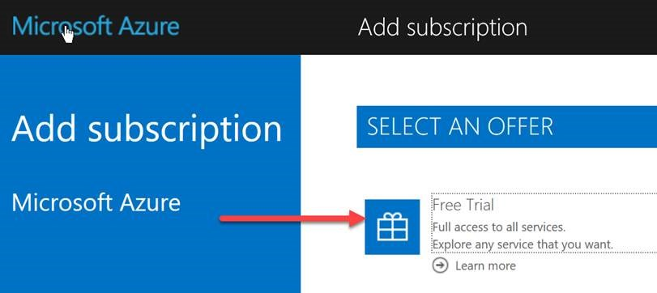

# Create an Azure Subscription

## Prerequisites: 
- A credit or debit card. Why? To keep out spam and bots; to verify your identity
- A phone number that can receive a voice call or text message.

## Steps

1.	Open a new browser tab and navigate to https://portal.azure.com. Sign-in using your work or school account. You may have created this account while following [these](README.md) instructions.

2.	On the left menu, select COST MANAGEMENT + BILLING. Then select + NEW SUBSCRIPTION.

    

3.	Select FREE trial.  
    
  
4.	Fill out the form, verify your identity by phone and by credit card, and agree to the agreement.

5.	Now prove that you own your domain name. Instructions are [here](ProveDomainOwnership.md).

