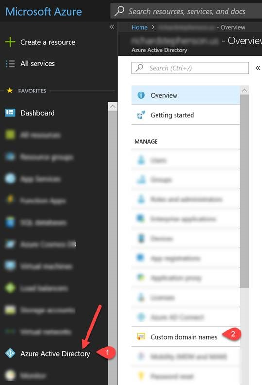

# Prove Domain Ownership

## Prerequisites: 
- Access to the domain registrar.
    - Someone at your business registered your company's domain name. You'll need to locate that person and ask them to perform step #3 below.

## Steps

1.	Open a new browser tab and navigate to https://portal.azure.com. Sign-in using your work or school account. You may have created this account while following [these](README.md) instructions.

2.	On the left menu, click  AZURE ACTIVE DIRECTORY and then click on CUSTOM DOMAIN NAMES.

      

3.	Follow the instructions to create a new TXT record with your domain name registrar.
    -   Note that adding a TXT record doesn't change any behaviors such as mail routing or web hosting.
    -   If verification fails, wait an hour. DNS records must propagate before Azure can verify the domain.
    -   You can check the progagation of the newly created TXT record [here](https://www.whatsmydns.net/#TXT/google.com).

4.	You are done!! Now is a good time to create additional users. Instructions are [here](https://docs.microsoft.com/en-us/azure/active-directory/fundamentals/add-users-azure-active-directory
).

5. Finally, it's probably a good time to start understanding the relationships of organizations, subscriptions, licenses, user accounts, and tenants across Microsoft's cloud offerings. [Here](https://docs.microsoft.com/en-us/office365/enterprise/subscriptions-licenses-accounts-and-tenants-for-microsoft-cloud-offerings) is a link to get you started.
