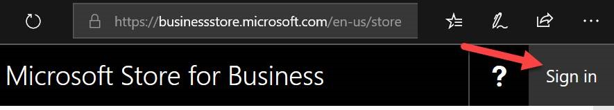

# Sign-up Your Organization For Microsoft's Cloud Offerings

1.	Navigate to https://signup.microsoft.com.

2.	Click on CREATE A WORK OR SCHOOL ACCOUNT.

3.	At the "let’s check if you have an account form", type in your work email address.

4.	Fill in the "get to know you" form. Use the same email address that you did in the previous step.

5.	Fill in the "create your user ID" form. The domain name you choose isn’t too important so don’t be upset if YourCompany. com is already taken. If it is do something like YourCompanyInc or YourCompanyLLC.

6.	Prove. You’re. Not. A. Robot.

7.	Now you have what Microsoft calls a **work or school account** account. Now **sign in**. Use the username and password you created in step #5.  

      

8. You'll now obtain a Microsoft Azure subscription. Instructions are [here](GetAzureSubscription.md).

